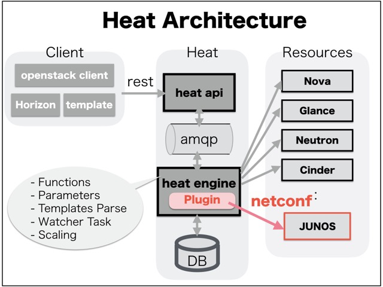

What's netconf_heat
==========
It works as Heat plugin extension for handling JUNOS configuration via netconf.



Environment
==========
- Openstack Heat in Mitaka edition
 ([Openstack Document: Install and configure](http://docs.openstack.org/mitaka/install-guide-ubuntu/heat-install.html))

Installation
==========
- Need to set "ssh port 830" for netconf in JUNOS router.

```
tsubo@SRX-1> configure
Entering configuration mode

[edit]
tsubo@SRX-1# set system services netconf ssh port 830
```

- Install ncclient package

```
$ sudo apt-get install python-ncclient
```

- Download netconf_heat

```
$ mkdir /sample
$ git clone https://github.com/ttsubo/netconf_heat.git
```
- Stop Heat-engine

```
$ sudo service heat-engine stop
```
- Edit the /etc/heat/heat.conf file

```
[DEFAULT]
...

plugin_dirs = /sample/netconf_heat/resources
```
- Start heat-engine

```
$ sudo service heat-engine start
```

Quick Start
===========
- Create Heat Stack via openstack client.

```
$ cd /sample/netconf_heat/templates
$ openstack stack create --parameter "router_ipaddr=192.168.200.101;username=xxxx;password=xxxx;router_port=830;policy_name=export-static;group_name=EXTERNAL;bgp_type=external;policy_statement=export-static;neighbor=192.168.0.2;peer_as=65001;static_route=0.0.0.0/0;next_hop=192.168.3.1;router_id=10.0.0.1;my_as=65000" --template junos_netconf.yaml SRX_1_stack
+---------------------+--------------------------------------+
| Field               | Value                                |
+---------------------+--------------------------------------+
| id                  | 34db21af-a024-4953-80ca-cbd5b15f8d06 |
| stack_name          | SRX_1_stack                          |
| description         | Netconf for Junos                    |
|                     |                                      |
| creation_time       | 2016-11-26T06:18:51                  |
| updated_time        | None                                 |
| stack_status        | CREATE_IN_PROGRESS                   |
| stack_status_reason | Stack CREATE started                 |
+---------------------+--------------------------------------+
```
- Checking the result of Heat stack.

```
$ openstack stack show SRX_1_stack
+-----------------------+---------------------------------------------------------------------------------------------------------------------------+
| Field                 | Value                                                                                                                     |
+-----------------------+---------------------------------------------------------------------------------------------------------------------------+
| id                    | 34db21af-a024-4953-80ca-cbd5b15f8d06                                                                                      |
| stack_name            | SRX_1_stack                                                                                                               |
| description           | Netconf for Junos                                                                                                         |
|                       |                                                                                                                           |
| creation_time         | 2016-11-26T06:18:51                                                                                                       |
| updated_time          | None                                                                                                                      |
| stack_status          | CREATE_COMPLETE                                                                                                           |
| stack_status_reason   | Stack CREATE completed successfully                                                                                       |
| parameters            | OS::project_id: 6f1763f7643e4ee9bb2d2d9dd9bb0bc6                                                                          |
|                       | OS::stack_id: 34db21af-a024-4953-80ca-cbd5b15f8d06                                                                        |
|                       | OS::stack_name: SRX_1_stack                                                                                               |
|                       | bgp_type: external                                                                                                        |
|                       | group_name: EXTERNAL                                                                                                      |
|                       | my_as: '65000'                                                                                                            |
|                       | neighbor: 192.168.0.2                                                                                                     |
|                       | next_hop: 192.168.3.1                                                                                                     |
|                       | password: xxxx                                                                                                            |
|                       | peer_as: '65001'                                                                                                          |
|                       | policy_name: export-static                                                                                                |
|                       | policy_statement: export-static                                                                                           |
|                       | router_id: 10.0.0.1                                                                                                       |
|                       | router_ipaddr: 192.168.200.101                                                                                            |
|                       | router_port: '830'                                                                                                        |
|                       | static_route: 0.0.0.0/0                                                                                                   |
|                       | username: xxxx                                                                                                            |
|                       |                                                                                                                           |
| outputs               | - description: display config_routing_options                                                                             |
|                       |   output_key: display_routing_options                                                                                     |
|                       |   output_value:                                                                                                           |
|                       |     config_routing_options: "\n## Last changed: 2016-11-26 15:19:04 JST\nrouting-options\                                 |
|                       |       \ {\n    static {\n        route 0.0.0.0/0 next-hop 192.168.3.1;\n    }\n  \                                        |
|                       |       \  router-id 10.0.0.1;\n    autonomous-system 65000;\n}\n"                                                          |
|                       | - description: display config_protocols                                                                                   |
|                       |   output_key: display_protocols                                                                                           |
|                       |   output_value:                                                                                                           |
|                       |     config_protocols: "\n## Last changed: 2016-11-26 15:19:04 JST\nprotocols {\n \                                        |
|                       |       \   bgp {\n        group EXTERNAL {\n            type external;\n          \                                        |
|                       |       \  export export-static;\n            neighbor 192.168.0.2 {\n             \                                        |
|                       |       \   peer-as 65001;\n            }\n        }\n    }\n}\n"                                                           |
|                       | - description: display config_policy_options                                                                              |
|                       |   output_key: display_policy_options                                                                                      |
|                       |   output_value:                                                                                                           |
|                       |     config_routing_options: "\n## Last changed: 2016-11-26 15:19:04 JST\npolicy-options\                                  |
|                       |       \ {\n    policy-statement export-static {\n        term 1 {\n            from\                                      |
|                       |       \ protocol static;\n            then accept;\n        }\n    }\n}\n"                                                |
|                       |                                                                                                                           |
| links                 | - href: http://localhost:8004/v1/6f1763f7643e4ee9bb2d2d9dd9bb0bc6/stacks/SRX_1_stack/34db21af-a024-4953-80ca-cbd5b15f8d06 |
|                       |   rel: self                                                                                                               |
|                       |                                                                                                                           |
| disable_rollback      | True                                                                                                                      |
| parent                | None                                                                                                                      |
| tags                  | null                                                                                                                      |
|                       | ...                                                                                                                       |
|                       |                                                                                                                           |
| stack_user_project_id | 4d93e1ad2a1045179a492c8d072f5827                                                                                          |
| capabilities          | []                                                                                                                        |
| notification_topics   | []                                                                                                                        |
| timeout_mins          | None                                                                                                                      |
| stack_owner           | None                                                                                                                      |
+-----------------------+---------------------------------------------------------------------------------------------------------------------------+
```

- You can check to configure via netconf as expected.

```
tsubo@SRX-1> show configuration

...

set routing-options static route 0.0.0.0/0 next-hop 192.168.3.1
set routing-options router-id 10.0.0.1
set protocols bgp group EXTERNAL type external
set protocols bgp group EXTERNAL export export-static
set protocols bgp group EXTERNAL neighbor 192.168.0.2 peer-as 65001
set policy-options policy-statement export-static term 1 from protocol static
set policy-options policy-statement export-static term 1 then accept

...

```
